# 特定领域语言智能客服系统----程序设计实践

本仓库作为大三上学期课程成果的备份，课程为程序设计实践。

此处简要介绍，详细介绍请看“总文档”。前端请见 frontend 分支，后端请见 backend 分支。

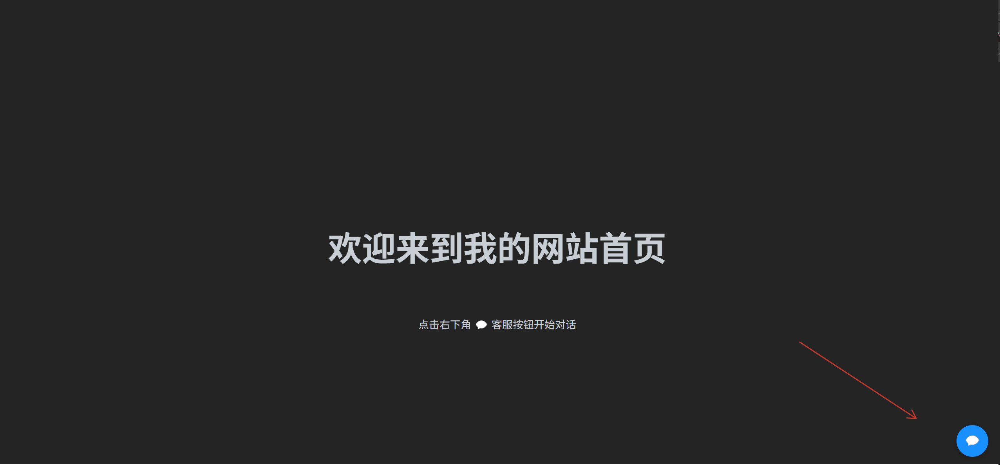

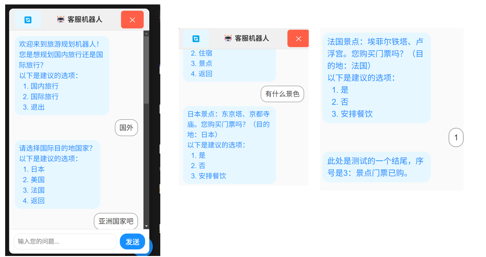

## 基本情况

是一个规模比较小的项目，传统客服机器人是基于规则的应答逻辑，接入一个语言模型就可以变得更加智能，“规则+智能”，体现在实现上就是“DSL+LLM”，所谓DSL就是“特定领域语言”。

依然采取B/S模式，Django+Vue3。分为五个模块。DSL描写了一个Moore机，这个Moore机表示了客服的运行逻辑。识别出用户意图之后，根据Moore机的状态转移，得到一个输出作为回复。

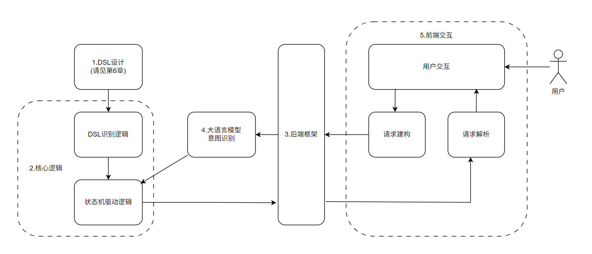

### 模块1：DSL设计

核心就是如何描述一个Moore机。

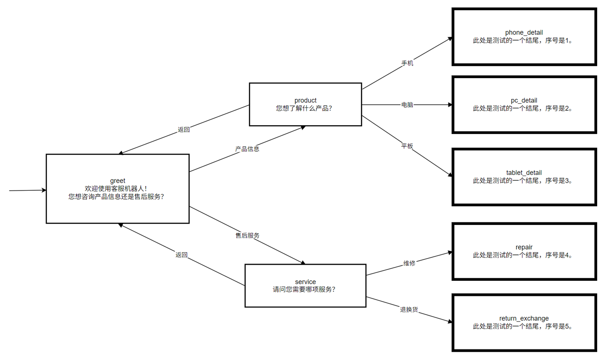

参考一个成熟方案，即Mermaid的描述：

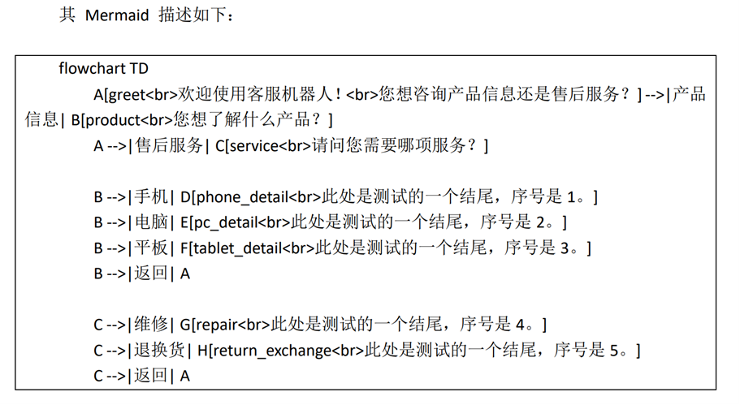

该方法无法显式描述起始状态、终结状态，需额外通过注释或逻辑推断；输出函数描述在状态首次出现的位置，不论是编写还是阅读都有诸多不便。Mermaid 需兼顾流程图、时序图等多种图示类型，语法存在冗余。

数学上，它的描写有几个要素：

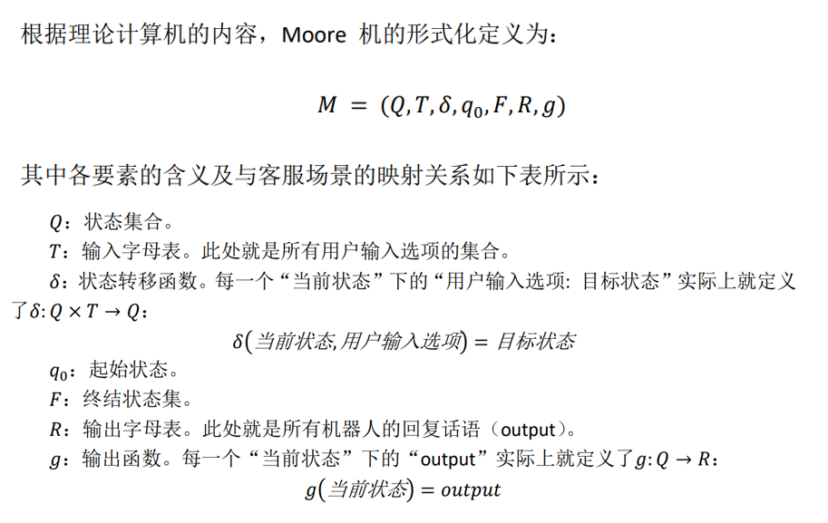

经过综合，得到如下的语法描述：

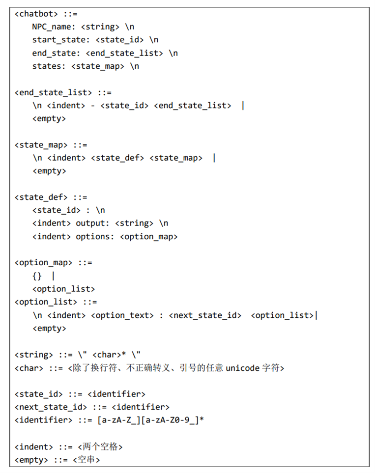

大致情况类似这样：

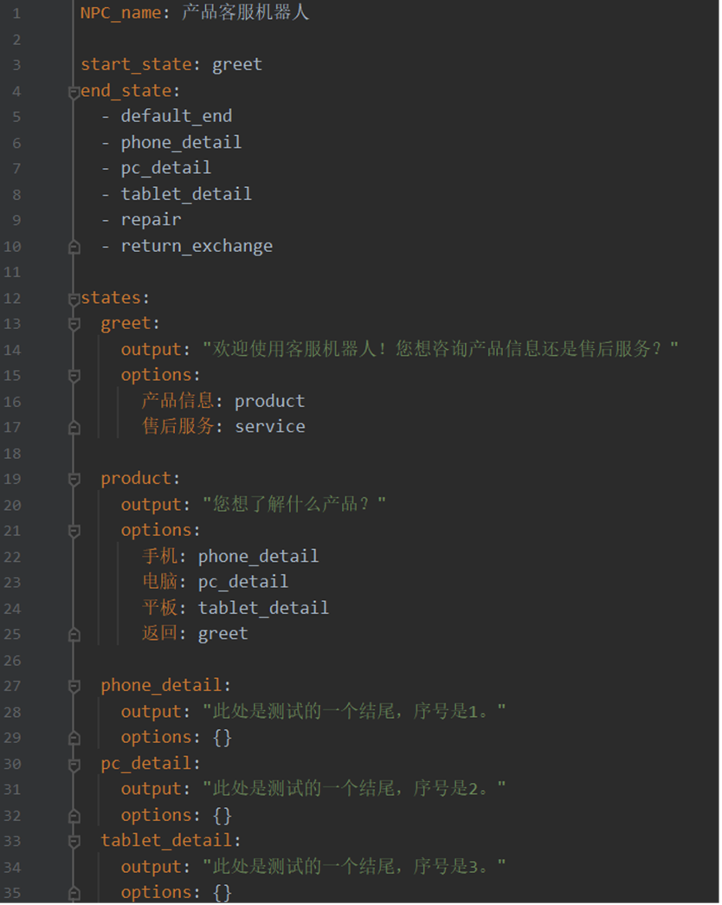

### 模块2：核心逻辑

这一模块要把核心逻辑跑起来。

前半部分：DSL识别逻辑

- 融合词法分析与语法分析，这种一体化的分析器是三种设计范式之一

- 实现一个LL(1)语法分析器

后半部分：状态机驱动逻辑

- 对话初始化（init_session）

- 对话过程处理（handle_message）

### 模块3：后端框架

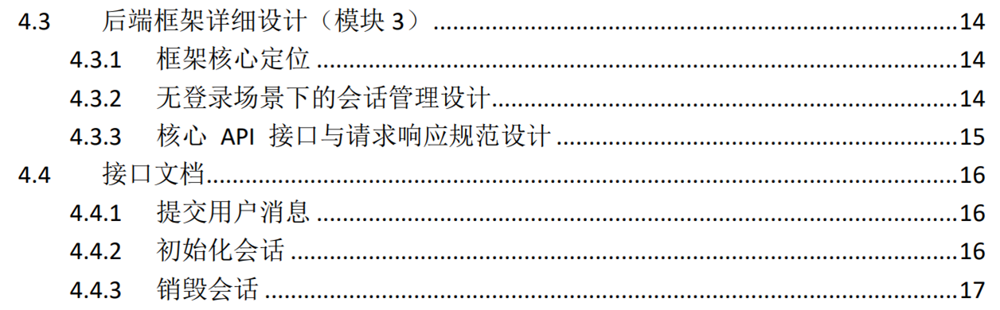

这部分比较关键的一点是：无登录场景。考虑到实际应用中多数客服机器人功能无需用户登录即可使用，本项目不实现登录功能，而是通过 current_sessions（核心逻辑模块 utils.py 中定义的全局字典）实现会话状态维护，确保每个网页实例的对话状态独立不冲突。

### 模块4：意图识别

语言模型选择上，选用通义千问 qwen-flash-2025-07-28 ，该模型轻量化，适合客服应答任务的即时性与直接性，可禁用深度思考流程，进一步缩短响应。

提示词工程上，完整提示词由 “任务定义区”“示例学习区”“规则约束区”“动态数据区”四部分组成。前三部分完整展示如下：

前三部分完整展示如下：

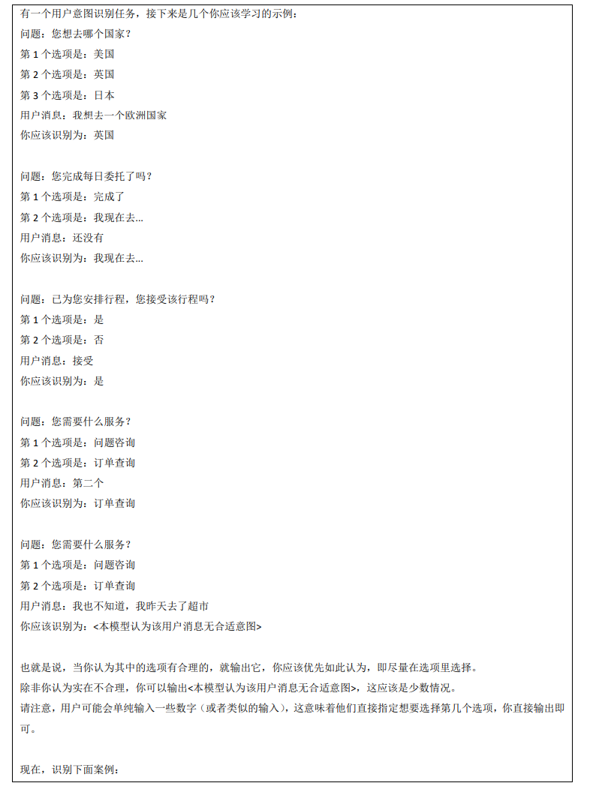

选项经过格式化，为每个选项添加序号（f"第{i+1}个选项是：{option}"），与示例学习区格式保持一致，便于模型关联 “数字输入” 与选项，降低识别误差。

### 模块5：前端交互

有几个特点：
1. 组件化设计。本模块实际上是在实现一个 Vue3 组件，BotService 组件，组件化设计的核心优势体现在独立性、可移植性等等。
2. 逻辑设计充分考虑到组件生命周期、标签页生命周期、会话会话生命周期的维护问题，避免无效会话的残留。
3. 交互设计美观合理。效仿市面常见即时通讯软件的设计，同时抓住各种细节，例如会话结束后对操作的禁用、收起会话框的灵活方法等。

## 测试

详见“总文档”，这里简要示意。

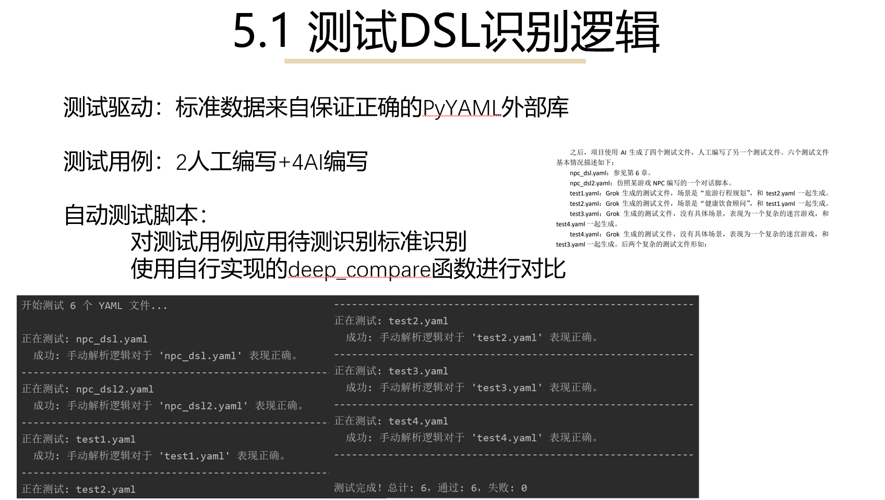

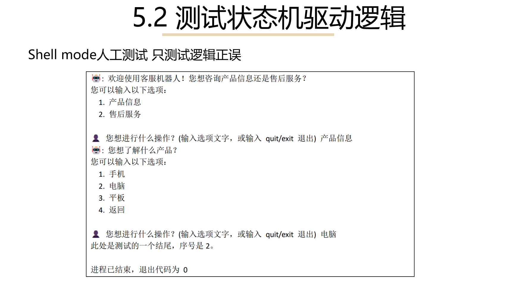

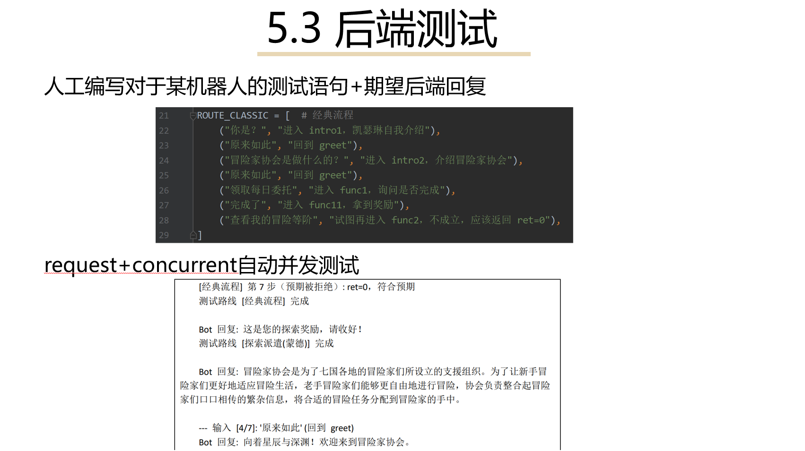

## 一些思考

由于本项目一开始在设计上就想实现一个客服机器人的万用方案，希望“后端把该项目的app包复制到根目录，setting.py注册好，编好DSL，前端复制到组件区，需要用到的位置导入，前后端启动”之后即可使用，这使得本项目难以设计用户的长效存储方案。

例如，假设确实需要用户首先登录，前后端交互都带着交互令牌，这固然是可行的，这样就可以存储用户关于一些信息的告知。体现在模块1上，该脚本可能自带一些特殊符号，其中可能涵盖一个正则表达式去识别用户告知的信息；体现在模块2上，自动机的基本模型是可以保持的，但是输出函数可能不简单是个字符串了，而是一系列关于增删改查的操作；体现在模块4上，关于大模型的提示词工程会更加复杂，因为既要设计选择类型的消息的返回（“选择疑问句”），又要设计增删改查类型消息的返回（“特殊疑问句”）。

这带来的另一个问题是非关系型数据库的应用。毕竟，DSL脚本是可以被编程的，而关系型数据库表结构的变化是困难的，这就意味着用户数据的长效存储需要额外的解决方案，最简单的是使用低效的文件存储。

然而，短效的存储方案是可能的。如果采用这个设计，进一步要思考的问题是，允许用户对这些短效存储进行什么操作。如果允许的操作足够复杂，这意味着该DSL脚本定义的模型行为完全有可能和一个图灵机等价（按照理论计算机的观点，达到这个表达能力需要的运算可能并不困难），进而和一套完善的编程语言等价。这附带的问题是该DSL可能会很复杂，需要大量学习时间。

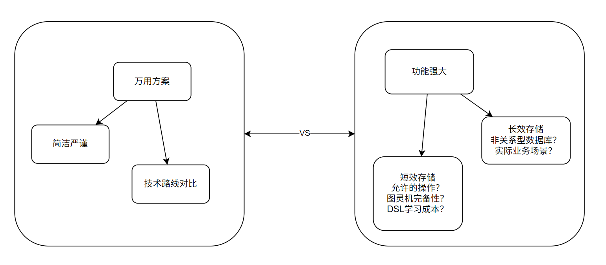
 
所以，放到具体实现上，本项目最终采用的模型是简单的，一个Moore机。本项目在推进时，力求体现出实现这一模型时候的复杂考量（严密说明设计DSL的思路、原因、结果，严密说明这个模型的道理，严密说明分析器的方案抉择，严密说明每个技术的选择），并且使得每一个模块划分合理，交互高效，环环相扣。

多功能的强效与严密的美感，这两种路线上的张力是否存在一个解决方案，可能是程序开发者们经常面对的问题。

